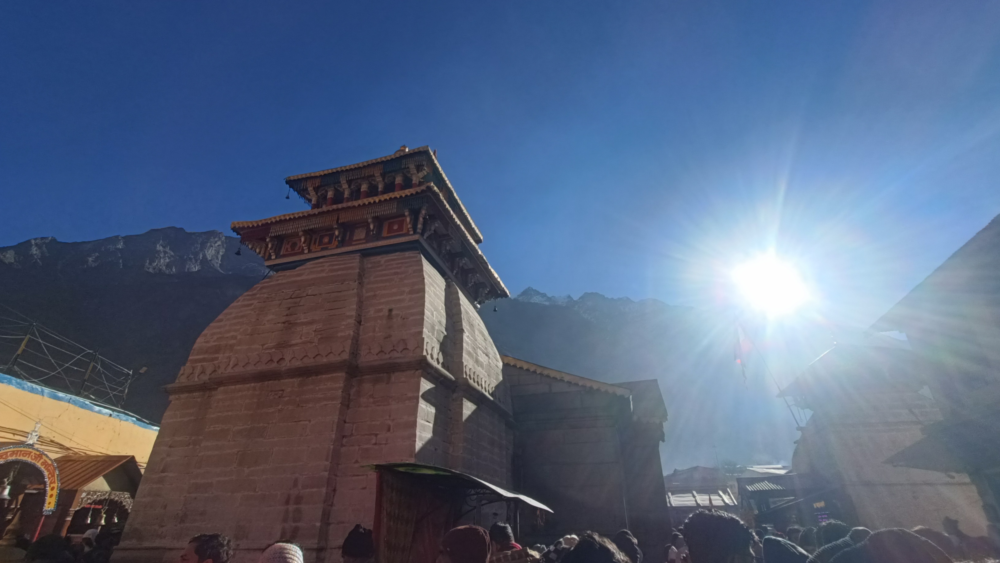

# Academic Portfolio — Dr. Mritunjay Shall Peelam

<div align="center">


### **Dr. Mritunjay Shall Peelam**
**Assistant Professor (Selection Grade) & Research Faculty**  
*Department of Computer Science & Engineering, UPES Dehradun, Uttarakhand, India*  
*Ph.D. in Electrical & Electronics Engineering, BITS Pilani*

[](https://dr-mritunjaysp.github.io/)
[](https://scholar.google.com/citations?user=mritunjaysp)
[](https://orcid.org/0000-0003-3987-2028)
[](https://github.com/dr-mritunjaysp)

</div>

---

## 📌 Project Overview

This repository contains the official personal and academic portfolio website of **Dr. Mritunjay Shall Peelam**. Built with **Next.js 16**, **React 19**, **TypeScript**, and **TailwindCSS / Custom CSS**, the application delivers a modern, high-performance, dark-mode-first academic platform without relying on legacy Jekyll or al-folio templates.

### 🔬 Core Research Domains
- **Blockchain & Distributed Ledgers**: Proof-of-Authority, Inter-Blockchain Communication (IBC), NFT Evidence Systems, V2V/V2G Energy Settlements.
- **Edge AI & Federated Learning**: Privacy-preserving onboard diagnostics, decentralized component degradation prediction.
- **Intelligent Transportation Systems (ITS)**: Location verification (V-Track), emergency vehicle signal preemption, IMEI theft prevention.
- **Quantum Computing & Post-Quantum Security**: FALCON lattice-based digital signatures, Quantum Key Distribution (QKD) for IoT networks.

---

## ✨ Features & Highlights

| Feature | Description |
| :--- | :--- |
| 📄 **Academic CV** | Comprehensive Curriculum Vitae featuring employment history, education, awards, research focus, and direct PDF download link. |
| 📚 **Publications** | Peer-reviewed Q1 IEEE/Elsevier journal articles with live citation tracking, abstracts, and DOI links. |
| 🕉️ **Daily Mantra** | Interactive collection of sacred Sanskrit stotrams (*Shiva Tandava*, *Karpura Gauram*, *Shri Hari Stotram*, *Hanuman Chalisa*) with modal verse reader. |
| 🏔️ **Travel Blog** | Stories, travel albums, and video logs covering Badrinath, Kedarnath, and Chakarata with interactive story modal. |
| 🎮 **Interactive Games & Teaching** | Embedded academic game modules, course summaries (*Software Engineering*, *OS*, *Data Structures*), and FDP details. |

---

## 🖼️ Media & Travel Highlights

<div align="center">

| Badrinath Dham | Kedarnath Dham | Chakarata Valleys |
| :---: | :---: | :---: |
|  |  |  |
| *अलकनंदा के संग, बद्रीनाथ दर्शन* | *हिमालय की दिव्यता, केदारनाथ धाम* | *चकराता की शांत वादियां* |

</div>

---

## 🛠️ Technology Stack

- **Framework**: Next.js 16 / Vinext / Vite 8
- **UI Components**: React 19, Lucide React, React Icons, Lottie Animations
- **Styling**: Modern CSS3 (Glassmorphism, Animated Gradients, Dark/Light Theme Switching)
- **Real-Time Data**: Firebase Realtime Database (Live visitor counter & citations metrics)
- **Containerization**: Docker & Docker Compose (Multi-stage build)

---

## 🚀 Quick Start Guide

### 🐳 Option 1: Open Locally with Docker (Recommended)

Make sure **Docker Desktop** is running, then execute:

```bash
# Build and run container on port 3000
docker compose up --build -d portfolio

# View container logs
docker compose logs -f portfolio

# Stop container
docker compose down
```

Open **`http://localhost:3000`** in your browser.

#### 🔄 Live Development Mode (Hot Reloading)

```bash
docker compose --profile dev up --build portfolio-dev
```
Open **`http://localhost:3001`**.

---

### 💻 Option 2: Run Locally without Docker

Requires **Node.js 22.13** or newer:

```bash
# Install dependencies
npm ci

# Start development server
npm run dev
```

Open **`http://localhost:3000`**.

---

### 🧪 Verification & Production Build

```bash
# Test production build & suite
npm run build
npm test
```

---

## 📬 Contact & Support

- **Email**: [mritunjay.iete@gmail.com](mailto:mritunjay.iete@gmail.com) \| [mritunjay.peelam@ddn.upes.ac.in](mailto:mritunjay.peelam@ddn.upes.ac.in)
- **Phone**: +91-8745080986
- **Location**: UPES Dehradun, Uttarakhand, India
- **GitHub Repository**: [dr-mritunjaysp-dr-mritunjaysp.github.io](https://github.com/dr-mritunjaysp/dr-mritunjaysp-dr-mritunjaysp.github.io)

---
© 2026 Dr. Mritunjay Shall Peelam. All rights reserved.
